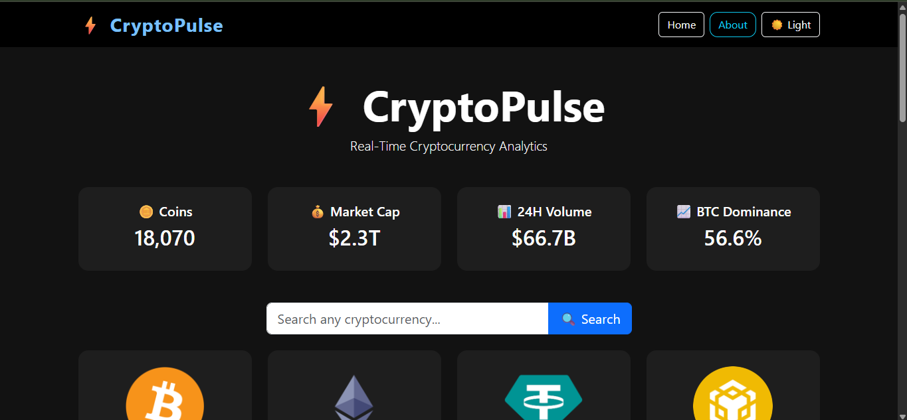
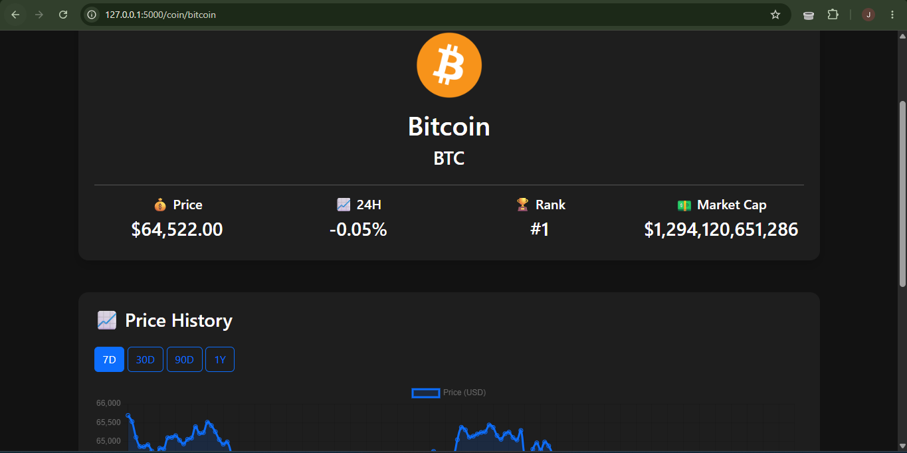
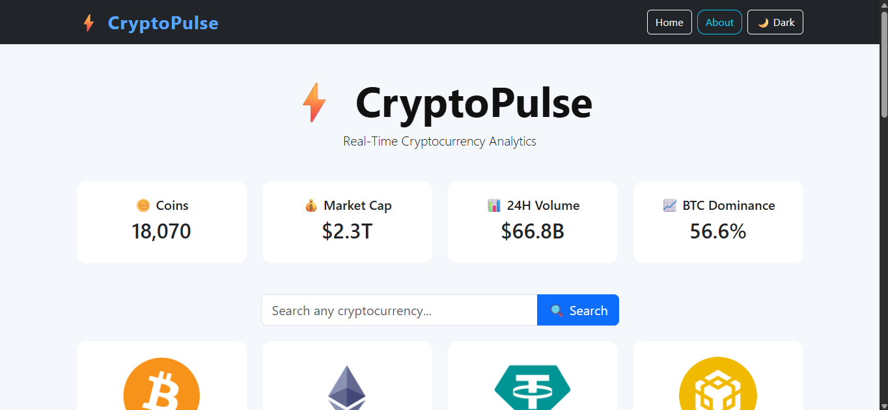
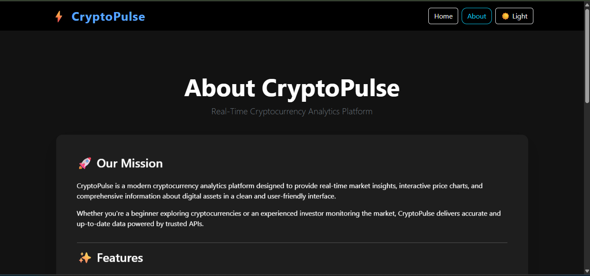

# ⚡ CryptoPulse

**Real-Time Cryptocurrency Analytics Platform**

CryptoPulse is a modern cryptocurrency analytics dashboard built with Flask that provides real-time cryptocurrency market data, interactive price charts, and detailed insights into digital assets through the CoinGecko API.

---

### SCREENSHOT

### 🏠 Dashboard



### 📈 Coin Details



### 🌙 light Mode



### ℹ️ About Page



---

## ✨ Features

- 📊 Real-time cryptocurrency market data
- 🔍 Search cryptocurrencies by name
- 📈 Interactive price charts (7D, 30D, 90D, 1Y)
- 💰 Global market overview
- 🌙 Dark & Light Mode
- 📱 Responsive design
- 📄 Detailed coin information
- 🚫 Custom 404 page
- 🧩 Component-based Flask architecture
- ⚡ Fast and clean user interface

---

## 🛠 Tech Stack

### Backend
- Python
- Flask

### Frontend
- HTML5
- CSS3
- Bootstrap 5
- JavaScript

### APIs
- CoinGecko API

### Charts
- Chart.js

---

## 📂 Project Structure

```text
CryptoPulse/
│
├── api/
├── static/
│   ├── css/
│   ├── js/
│   └── images/
│
├── templates/
│   ├── components/
│   ├── base.html
│   ├── index.html
│   ├── coin.html
│   ├── coin_details.html
│   ├── about.html
│   └── 404.html
│
├── screenshots/
├── app.py
├── requirements.txt
├── README.md
└── .gitignore
```

---

## 🚀 Installation

Clone the repository

```bash
git clone https://github.com/oladipojoshua/CryptoPulse.git
```

Navigate into the project

```bash
cd CryptoPulse
```

Create a virtual environment

```bash
python -m venv venv
```

Activate the virtual environment

### Windows

```bash
venv\Scripts\activate
```

### macOS/Linux

```bash
source venv/bin/activate
```

Install dependencies

```bash
pip install -r requirements.txt
```

Run the application

```bash
python app.py
```

Open your browser

```
http://127.0.0.1:5000
```

---

## 🌐 API

CryptoPulse uses the **CoinGecko API** to retrieve:

- Live market prices
- Cryptocurrency search
- Coin details
- Historical price data
- Global market statistics

---

## 🔮 Future Improvements

- ⭐ Watchlist / Favorites
- 🔔 Price alerts
- 📊 Portfolio tracker
- 🌍 Multi-currency support
- 📉 Advanced chart indicators
- 👤 User authentication

---

## 👨‍💻 Developer

**Joshua Oladipo**

Data Analyst • Python Developer • Blockchain Enthusiast

GitHub: https://github.com/oladipojoshua

LinkedIn: https://www.linkedin.com/in/joshua-eniola-oladipo-a186b0320/

---

## 📜 License

This project is licensed under the MIT License.

---

⭐ If you found this project useful, consider giving it a star on GitHub!